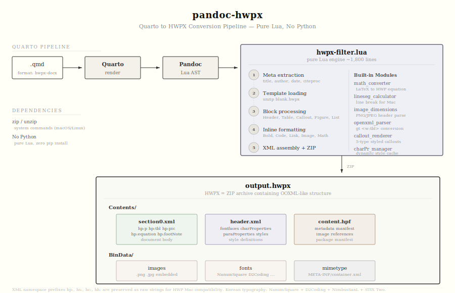

# pandoc-hwpx

Quarto 문서(.qmd)를 한글과컴퓨터 **HWPX** 문서로 변환하는 Quarto extension.

> HWPX는 한글과컴퓨터의 개방형 문서 포맷이다.
> 내부는 ZIP 아카이브이며 OOXML과 유사한 XML 구조를 갖는다.
> 이 패키지는 Quarto가 생성한 Pandoc JSON AST를 읽어 HWPX의 XML을 직접 조립한다.

---

## Architecture

<p align="center">
  
</p>

`quarto render`가 `.qmd`를 처리하면 내부 Pandoc이 JSON AST를 생성한다.
Lua 필터(`hwpx-filter.lua`)가 이를 가로채 `pandoc.pipe()`로 Python 엔진을 호출하고,
Python 엔진(`PandocHwpxConverter`)이 HWPX XML을 조립하여 `.hwpx` 파일을 생성한다.

```
.qmd → Quarto render → Pandoc → Lua Filter → Python Engine → .hwpx
```

Lua 필터가 citeproc 실행과 TOC 감지도 처리한다.

---

## Install

```bash
# 1. Python 엔진 설치 (PyPI)
pip install pandoc-hwpx

# 2. Quarto extension 설치 (GitHub)
quarto add bit2r/pandoc-hwpx
```

의존성은 **Pillow** 하나뿐이다 (이미지 크기 자동 계산).
없어도 동작하되 기본 크기가 적용된다.

---

## Usage

### `_quarto.yml` 설정

```yaml
format:
  hwpx-docx:
    toc: true
    bibliography: references.bib
```

### 렌더링

```bash
quarto render example.qmd --to hwpx-docx
```

---

## Converter Engine

`PandocHwpxConverter`는 약 2,000줄의 단일 클래스로,
JSON AST를 5단계에 걸쳐 HWPX로 변환한다.

| Stage | Operation | Detail |
|:-----:|:----------|:-------|
| 1 | Meta extraction | title, author, date, bibliography |
| 2 | Template loading | `blank.hwpx` 내장 템플릿 |
| 3 | Block processing | Header, Para, Table, CodeBlock, List, BlockQuote, ... |
| 4 | Inline formatting | Bold, Italic, Code, Link, Image, Math, Footnote |
| 5 | XML assembly | section0.xml + header.xml + content.hpf |

---

## Supported Elements

### Blocks

| Pandoc | HWPX |
|:-------|:-----|
| `Header` 1--6 | 개요 스타일, H1=22pt / H2=16pt / H3=13pt |
| `Para`, `Plain` | `<hp:p>` + 인라인 서식 + linesegarray |
| `CodeBlock` | D2Coding, 줄별 `<hp:p>` |
| `Table` | `<hp:tbl>`, rowspan/colspan, occupied-cell 추적 |
| `BulletList` | 네이티브 numbering 또는 텍스트 prefix |
| `OrderedList` | 네이티브 numbering 또는 텍스트 prefix |
| `BlockQuote` | 전각 공백 들여쓰기 |
| `DefinitionList` | 용어 + 들여쓰기 정의 |
| `HorizontalRule` | 구분선 |
| `Div` | Quarto 셀 래퍼 투명 패스스루 |
| `LineBlock` | 줄별 단락 생성 |

### Inlines

| Pandoc | HWPX |
|:-------|:-----|
| `Strong` | charPr bold |
| `Emph` | charPr italic |
| `Underline` | charPr underline |
| `Strikeout` | charPr strikeout |
| `Code` | D2Coding charPr |
| `Link` | fieldBegin/fieldEnd, 파란색 밑줄 |
| `Image` | `<hp:pic>`, Pillow 자동 크기, BinData 임베딩 |
| `Math` | `<hp:equation>`, LaTeX to HWP script |
| `Note` | `<hp:footNote>` + `<hp:subList>` |
| `Quoted` | 유니코드 인용부호 |
| `Superscript` | charPr supscript |
| `Subscript` | charPr subscript |

### Quarto Code Output

Quarto가 실행한 R/Python 코드의 결과물도 변환한다.

| Output | HWPX |
|:-------|:-----|
| ggplot / matplotlib image | `<hp:pic>` 임베딩 |
| kable / gt table | `<hp:tbl>` 변환 |
| text output | D2Coding 코드블록 |
| source code | D2Coding 코드블록 |

---

## Typography

한국어 문서를 위한 폰트 매핑.

| Language | Font | Purpose |
|:---------|:-----|:--------|
| HANGUL | NanumSquare | 한글 본문, 제목 |
| LATIN | NimbusSanL | 영문 산세리프 |
| HANJA | Noto Sans CJK KR | 한자 |
| SYMBOL | STIX Two Text | 수식, 기호 |
| CODE | D2Coding | 코드블록, 인라인 코드 |

모든 폰트는 패키지에 번들되어 있다.
별도 설치 없이 HWPX 파일에 임베딩된다.

---

## HWPX File Structure

생성되는 HWPX 파일의 내부 구조.

```
output.hwpx (ZIP)
├── mimetype
├── META-INF/
│   └── container.xml
├── Contents/
│   ├── content.hpf          metadata, manifest
│   ├── header.xml            fontfaces, charProperties, styles
│   └── section0.xml          document body (hp:p, hp:tbl, hp:pic, ...)
└── BinData/
    ├── image1.png            embedded images
    └── ...
```

XML namespace prefix `hp:`, `hs:`, `hc:`, `hh:`는
한글 Mac 호환성을 위해 raw 문자열로 유지한다.

---

## Project Layout

```
pandoc-hwpx/
├── pandoc_hwpx/              Python engine (pip install)
│   ├── converter.py          main engine, ~2,000 lines
│   ├── math_converter.py     LaTeX to HWP equation script
│   ├── lineseg.py            line break calculation for Mac
│   └── templates/            blank.hwpx + bundled fonts
├── _extensions/hwpx/         Quarto extension (quarto add)
│   ├── _extension.yml
│   └── hwpx-filter.lua       67-line Lua wrapper
├── examples/                 example documents
└── tests/
```

---

## Heritage

이 패키지는 두 프로젝트의 장점을 통합한 것이다.

**quarto-hwpx** ---
수식 변환, lineseg 계산, 한국어 폰트 매핑, 블록 타입 처리.

**pypandoc-hwpx** ---
인라인 서식, 이미지 임베딩, 테이블 rowspan/colspan,
하이퍼링크, 각주, 네이티브 목록.

---

## License

MIT
